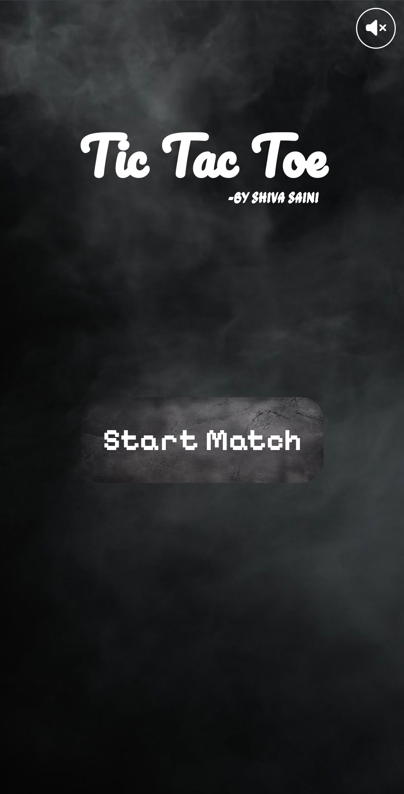
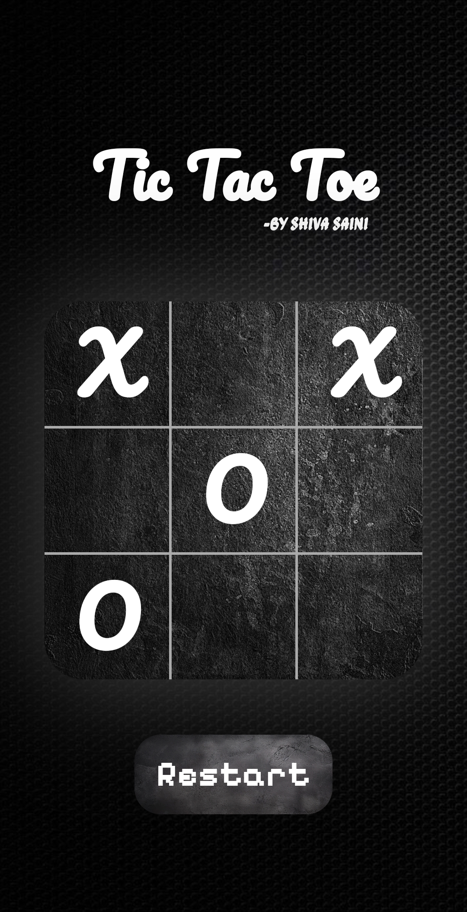

# Whisper — A Horror Tic Tac Toe 🕯️

A classic Tic-Tac-Toe, reimagined with a horror atmosphere: flickering
title, blood-red vs bone-white marks, ambient sound, and a board that
bleeds when someone wins.

Live: https://shiva-sainiiii.github.io/Tic-Tac-Toe/
*(update this link once the Vercel deploy is live)*

## Preview




## Features

- Two-player local play, alternating turns (O goes first)
- Win detection with an animated "bleeding" win line
- Draw detection with its own message
- Auto-reset after a win or draw
- Ambient sound effects with a mute toggle
- Fully responsive, works down to small phone screens
- Respects `prefers-reduced-motion` for accessibility

## Tech stack

- HTML5
- CSS3 (custom properties / design tokens, grid layout, animations)
- Vanilla JavaScript (no framework, no build step)

## Project structure

```
horror-tic-tac-toe/
├── index.html
├── css/
│   └── styles.css
├── js/
│   └── script.js
├── assets/
│   ├── images/
│   ├── audio/
│   └── video/
└── README.md
```

## Running locally

No build step needed — just open `index.html` in a browser, or serve
the folder with any static server:

```bash
npx serve .
```

## Roadmap

- [ ] Deploy to Vercel
- [ ] Add a single-player mode (vs. a simple AI)
- [ ] Add score tracking across rounds
- [ ] Custom cursor / hover states for extra atmosphere

## Contributing

Forks and PRs welcome — this is an ongoing personal project I keep
improving as I learn.

## License

MIT — see LICENSE for details.

## Author

Shiva Saini
